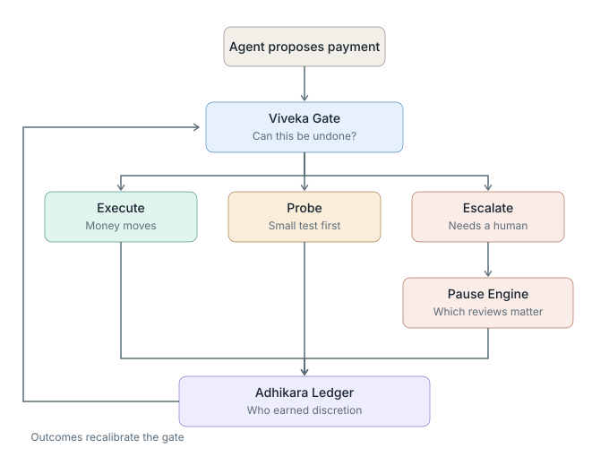

# Dharma Payments

**Governance for AI agents that move money.**

An AI agent paying invoices cannot tell a real vendor from a criminal impersonating
one, because business email compromise is engineered to produce high confidence. A
fake invoice carries the real vendor's name, a plausible invoice number, urgency, and
changed bank details. Confidence is the one signal the attacker controls.

Three components, each answering a question the previous one leaves open.

The gate decides, the Pause Engine works the escalations cheaply, and every resolved
outcome feeds the ledger, which recalibrates the gate. That return path is why the
system becomes less intrusive over time rather than more.

## [Viveka Gate](./viveka-gate) v0.1.2

**Should this payment execute?**

Decides by what the attacker cannot fake: whether the money could be recovered if the
payment turns out to be wrong. Reversibility is computed per transaction by a backward
Monte Carlo over recall mechanics, calibrated to FBI Financial Fraud Kill Chain
statistics and the FinCEN international recovery threshold. Execution, a reversible
test payment, and human escalation compete on expected cost, so deferral is priced
rather than treated as a free safe harbour.

Roughly half the catastrophic loss of a confidence threshold at matched friction.

## [Adhikara Ledger](./adhikara-ledger) v0.2

**Who has earned the right not to be second-guessed?**

The earned trust ledger. Runs first in shadow mode, observing without blocking, which
is the only period in which outcome labels are uncensored: once a gate blocks a
payment, that payment never resolves and the system can never learn about the cases
where it is most cautious. Fraud is far too rare to calibrate on, so trust is learned
from abundant signals instead and accrues per counterparty rather than per category.

Trust binds to payee identity, account fingerprint, and the amount envelope that
earned it. Change the bank details, which is precisely what this fraud does, and
earned trust is void. Also measures the deployment's own fraud base rate and
configures the gate from it, closing a parameter that would otherwise be guessed.

Friction falls from 64 percent to 44 percent with protection held constant.

## [Pause Engine](./pause-engine) v0.1

**What happens after the gate says escalate?**

Decomposing the friction metric showed the real barrier was never the percentage of
payments held. It was that clearing the review queue required 19.7 analyst hours per
week against an incumbent 0.4, roughly half a full-time reviewer. The gate cannot fix
that, because those payments genuinely are uncertain. The cost has to come out of the
review itself.

Prefilled evidence, counterfactual-value triage, a worthiness threshold, same-payee
batching, and explicit timeout defaults, because a payment held indefinitely because
nobody looked is the worst outcome in the system.

19.7 analyst hours per week become 5.3, at identical protection.

## Three findings worth reading

**Earned trust is an attack surface.** An earlier ledger design bound trust to segment
labels such as vendor class and bank type, reporting an excellent 17 percent friction.
Under adversarial test its catch rate collapsed to near zero, because segment labels
are attributes an attacker selects. The honest price of attack-resistant automation is
44 percent, not 17.

**Measuring honestly made the system look worse, and that was the point.** Splitting
friction into human time, automated probes, and dollar-weighted delay showed dollar
friction exceeding event friction, and surfaced the analyst-hours figure that redirected
the entire roadmap.

**Ranking by importance can be worse than not ranking at all.** The Pause Engine's
first triage key ordered reviews by stake and performed worse than arrival order,
because the highest-stake payments are already held safely by default. A review is
only worth its cost when the default would be risky. Correcting for that took
unreviewed released value to zero.

One unsolved case remains and is documented rather than hidden: an adversary
presenting the real payee, the real account, and an ordinary amount. Nothing in such a
transaction is wrong, and it requires out-of-band verification rather than better
inference.

## Reading order

Start with [JAYS_README.md](./JAYS_README.md) for a plain language explanation of all
three components. Each folder then has its own README with methodology, calibration
sources, and limitations.

## Status

Research prototype. Synthetic transaction streams; recovery calibration anchored to
aggregate published statistics rather than transaction level data; ablations run on a
single seed. Collaboration and critique welcome, particularly from payments and fraud
operations practitioners who can identify where the recovery model is naive.

Part of the DharmaAGI architecture: governance components for agentic systems.
