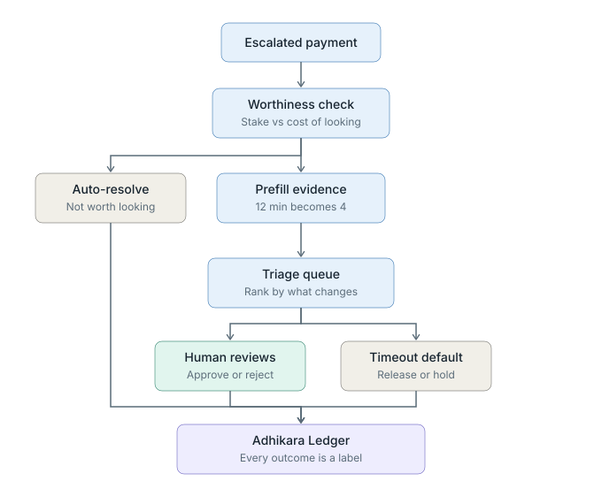

# Pause Engine v0.1

**What happens after the gate says escalate.**

The Viveka Gate decides whether to pause. Until now escalation was a black box: the
payment went to "a human" and the story ended. Decomposing the friction metric showed
that this is where the cost actually lives. The gate needed **19.7 analyst hours per
week** against an incumbent process using 0.4, roughly half a full-time reviewer. No
finance team buys that.

The gate cannot fix it. Those escalations are genuinely uncertain payments and the
gate is right to flag them. The cost has to come out downstream, by making each
escalation cheaper rather than rarer.

Colour carries meaning here: blue is engine processing, grey is resolved without a
human, teal is resolved by a human. Two of the three exit paths never consume analyst
attention, which is where the hours go.

Three things the diagram makes explicit. The worthiness check sits **before** the
queue, so payments whose stake is smaller than the cost of looking never enter it at
all. Prefill sits between the check and the queue, and carries almost the entire
saving despite being the least sophisticated mechanism. And the timeout default is a
first-class exit rather than a failure mode, governed by a structural rule: release
only what could survive being wrong.

## Result

Mean across 15 seeds:

| | analyst hrs/week | sd |
|---|---|---|
| Escalation as a black box | 18.9 | 0.5 |
| Pause Engine | **5.1** | 0.1 |

**73.0% less analyst time (sd 0.5) at unchanged protection.** One of the most stable
results in the repository.

## What each mechanism actually contributed

| cumulative | hrs/week |
|---|---|
| Arrival order, cold reviews | 19.6 |
| + prefilled context | 6.6 |
| + expected-value triage | 6.5 |
| + worthiness threshold | 5.4 |
| + same-payee batching | 5.3 |

Almost the entire saving comes from **prefilled context**, the least sophisticated
mechanism in the design. Most review time was being spent reconstructing why the
payment was flagged and what the payee's history looked like, all of which the gate
and the ledger already knew and simply were not showing the reviewer. Showing it cuts
a review from roughly 12 minutes to 4.

Triage, batching, and the worthiness threshold together account for less than a fifth
of the improvement. This is worth stating plainly because the reverse would have been
assumed.

## Design error found and corrected

The first triage key ranked items purely by stake: probability of fraud times
unrecoverable amount. Under scarce capacity this measurably made outcomes **worse**,
leaving $106,000 of unreviewed value released at 15 minutes per day of capacity,
against $60,724 for simple arrival order.

The cause: the highest-stake items are precisely the ones the timeout default already
handles safely, because large unrecoverable payments are auto-*held* rather than
released. Ranking by stake spent scarce review capacity on items that were already
safe, while auto-release-eligible items timed out unreviewed.

A review is only worth its cost when the default disposition would be risky. The
corrected key conditions stake on whether the engine would otherwise release the item.

**A second correction followed.** The first fix discounted would-be-held items by an
arbitrary factor of 0.1, which was flagged at the time as a placeholder rather than a
derived term. Building the interactive demo exposed why it was inadequate: ten percent
of a very large stake still outranks the full stake of a small releasable payment, so
the ordering barely changed where it mattered most. The discount is now derived. When
the default is HOLD the money is already safe either way, so a review buys only the
avoided delay on a probably-legitimate payment, a value bounded by the holding period
and unrelated to the size of the loss that was never going to happen.
Result at the same capacity: **$0** unreviewed value released, on every one of 15
seeds and at every capacity level tested, against a mean of $29,845 for arrival
order.

## Timeout defaults

An escalation nobody answers is the worst outcome in the system: it blocks a
legitimate payment indefinitely while providing no safety benefit. Every paused item
carries an explicit expiry and a default chosen by structure rather than convenience.
Release only what could survive being wrong, meaning recoverable enough and small
enough. Everything else stays held and is reported as unresolved rather than quietly
released.

A queue that silently grows is a failure mode, not a steady state, so the engine
reports backlog explicitly and separates deliberate policy dispositions from timeouts.

## Files
`pause.py` (engine, triage, context assembly, expiry) · `pause_demo.html` (interactive) · `pause_ablation.json`

## Lineage
Third executable component of DharmaAGI. The Pause Engine is what the gate's pause
actually resolves into: not an indefinite hold, but a bounded, prioritised, and
explicitly defaulted deferral.
